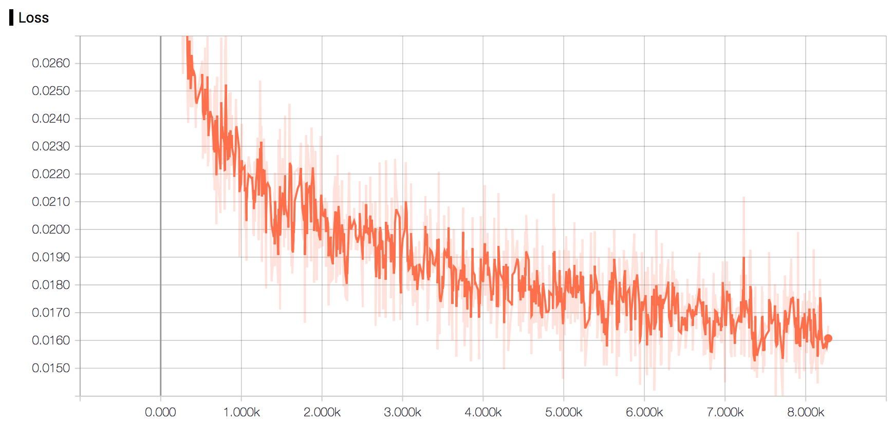
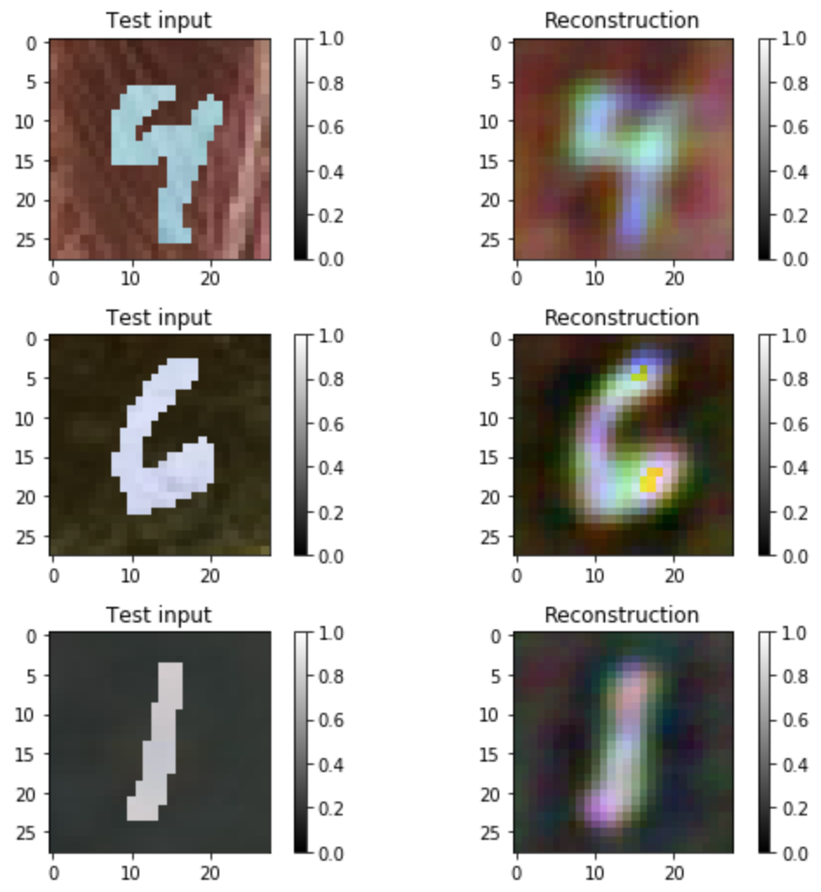
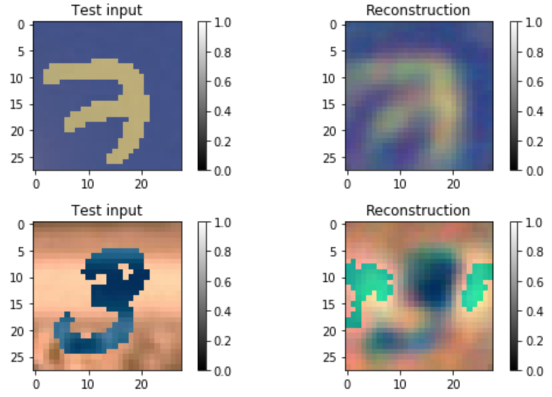

# CNN_AUTOENCODER


Usage
-----

To train a model

	$ python run.py --num_epochs=10 --plot

All options
```
usage: run.py [-h] [--num_epochs NUM_EPOCHS] [--batch_size BATCH_SIZE]
              [--mode MODE] [--plot]

optional arguments:
  -h, --help            show this help message and exit
  --num_epochs NUM_EPOCHS
                        Specify the number of epoches
  --batch_size BATCH_SIZE
                        Specify batch size
  --mode MODE           Specify mode: `train` or `eval`
  --plot                Whether plot the reconstructed images or not
```


Loss & Reconstruction
---------------------

After training 8000+ steps ...

- Loss



- Reconstructed MNIST images




